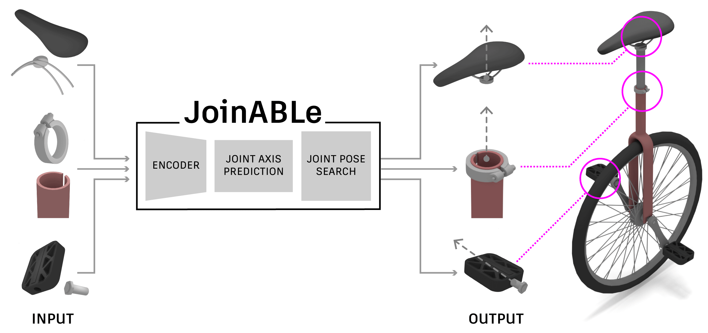
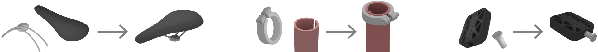
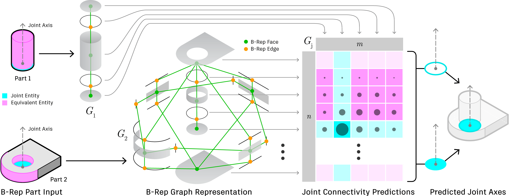
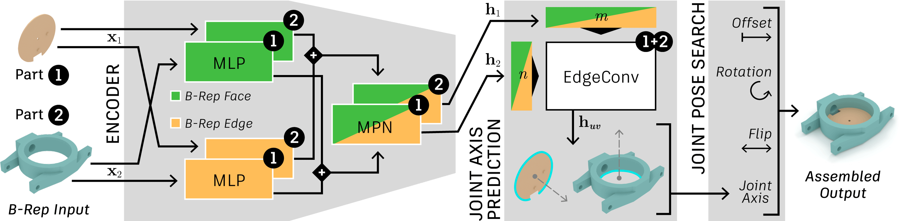

# JoinABLe
This repository contains code for our CVPR 2022 paper:
[JoinABLe: Learning Bottom-up Assembly of Parametric CAD Joints](https://arxiv.org/abs/2111.12772)



**Authors**: Karl D.D. Willis, Pradeep Kumar Jayaraman, Hang Chu, Yunsheng Tian, Yifei Li, Daniele Grandi, Aditya Sanghi, Linh Tran, Joseph G. Lambourne, Armando Solar-Lezama, Wojciech Matusik

## About JoinABLe
Physical products are often complex assemblies combining a multitude of 3D parts modeled in computer-aided design (CAD) software. CAD designers build up these assemblies by aligning individual parts to one another using constraints called joints. JoinABLe is a learning-based method that assembles parts together to form joints. JoinABLe uses the weak supervision available in standard parametric CAD files without the help of object class labels or human guidance. Our results show that by making network predictions over a graph representation of solid models we can outperform multiple baseline methods with an accuracy (79.53%) that approaches human performance (80%).

### Task

Given a pair of parts, we aim to create a parametric joint between them, such that the two parts are constrained relative to one another with the same joint axis and pose as defined by the ground truth. 


### Representation
JoinABLe takes as input a pair of parts in the B-Rep format. We represent each part as a graph derived from the B-Rep topology. Graph vertices are either B-Rep faces or edges and graph edges are defined by adjacency.



This approach enables us to make predictions over the exact entities used to define joints, rather than an intermediate representation such as a mesh or point cloud. Importantly, it allows us to frame the problem as a categorical one, by making predictions over the discrete set of B-Rep entities that contain ground truth information about the joint axis.

### Architecture
Our overall architecture is shown in the figure below and consists of an encoder module that outputs per-vertex embeddings for each B-Rep face and edge in our graph representation of the input parts. Using these embeddings we can predict a joint axis and then search for joint pose parameters.



Additional details can be found in the [paper](https://arxiv.org/abs/2111.12772).


### Citation
```
@inproceedings{willis2022joinable,
    title = {JoinABLe: Learning Bottom-up Assembly of Parametric CAD Joints},
    author = {Willis, Karl DD and Jayaraman, Pradeep Kumar and Chu, Hang and Tian, Yunsheng and Li, Yifei and Grandi, Daniele and Sanghi, Aditya and Tran, Linh and Lambourne, Joseph G and Solar-Lezama, Armando and Matusik, Wojciech},
    booktitle = {Proceedings of the IEEE/CVF Conference on Computer Vision and Pattern Recognition (CVPR)},
    month = {June},
    year = {2022}
}
```


## Environment Setup
We use [conda](https://conda.io/) to setup the training environment. On GPU use:
```
conda env create -f environment.yml
```
Or if using CPU:
```
conda env create -f environment_cpu.yml
```
This will create an environment called `joinable_env` that can be activated using:
```
conda activate joinable_env
```
If you experience issues with conflict errors while setting up the environment, on newer versions of conda you may need to set the channel priority to flexible:
```
conda config --set channel_priority flexible
```

## Dataset
To train JoinABLe, please download the joint data provided with the [Fusion 360 Gallery Assembly Dataset](https://github.com/AutodeskAILab/Fusion360GalleryDataset). For convenience, we provide the direct links below and also provide a preprocessed version of the joint data. The preprocessed version can be used to get started training quicker. For joint pose search, download both to the same folder structure, placing the preprocessed .pickle files in the same directory as the joint .json and part .obj files.

### Download
- Joint Data: [j1.0.0 - 2.8 GB](https://fusion-360-gallery-dataset.s3.us-west-2.amazonaws.com/assembly/j1.0.0/j1.0.0.7z)
- Joint Data - Preprocessed: [j1.0.0 - 514 MB](https://fusion-360-gallery-dataset.s3.us-west-2.amazonaws.com/assembly/j1.0.0/j1.0.0_preprocessed.7z)

The dataset license can be viewed [here](https://github.com/AutodeskAILab/Fusion360GalleryDataset/blob/master/LICENSE.md). 


## Joint Axis Prediction
For the joint axis prediction task, the goal is to correctly predict a pair of B-Rep entities that form a joint axis that aligns with the ground truth. We formulate this as a link prediction problem and train our model using the weak supervision provided by user selected joints in the dataset.

### Training
After setting up the environment and downloading the data the training script can be run using:
```
python train.py --dataset path/to/dataset --exp_name my_experiment
```
This will load the dataset from the `path/to/dataset` directory and save checkpoints and logs to the `results/my_experiment` directory.


### Testing
After training, to evaluate the model on the test set use:
```
python train.py --traintest test --dataset path/to/dataset --exp_name my_experiment --checkpoint last
```
This will load the test dataset from the `path/to/dataset` directory and the last saved checkpoint from the `results/my_experiment` directory.


### Pretrained Models
The [pretrained](pretrained/) directory contains the pretrained models used in the JoinABLe paper. There are five pretrained models, each trained with different random seeds. To evaluate the first pretrained model, use the following command:
```
python train.py --traintest test --dataset path/to/dataset --exp_dir pretrained --exp_name paper --checkpoint last_run_0
```

### Visualize Results
Refer to the [`notebooks/joint_prediction_viewer.ipynb`](notebooks/joint_prediction_viewer.ipynb) notebook to visualize the results of joint axis predictions.


## Joint Pose Search
Given a predicted joint axis, we perform a joint pose search to find a desirable joint configuration. To run joint pose search you need to download the joint data (not the preprocessed data) that contains the json joint files and the obj meshes for each part.

### Running Search
To run search on the last checkpoint of a model you have trained:
```
python search.py --dataset path/to/dataset --exp_name my_experiment --checkpoint last
```
This will run search on the test dataset from the `path/to/dataset` directory and the last saved checkpoint from the `results/my_experiment` directory.


To run search using the first pretrained model, use the following command:

```
python search.py --dataset path/to/dataset --exp_dir pretrained --exp_name paper --checkpoint last_run_0
```

### Visualize Results
Refer to the [`notebooks/joint_search_viewer.ipynb`](notebooks/joint_search_viewer.ipynb) notebook to visualize the results of joint pose search.
